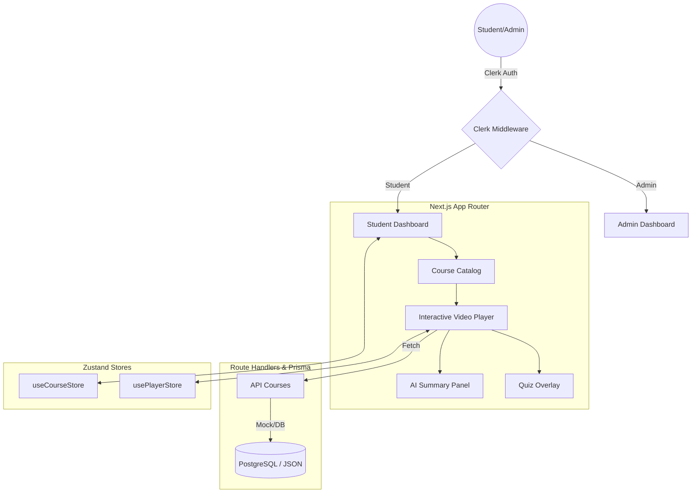

# Dushala Business Academy — Production MVP

## 1. Project Overview & Purpose
Dushala Business Academy is a specialized D2C business coaching platform built for Indian women entrepreneurs. It provides a luxury, high-end learning experience with multilingual support (English, Hindi, Telugu), interactive video quizzes, and AI-generated lesson summaries.

## 2. Architecture Diagram

## 3. Data Flow
- **Authentication:** Users sign in via Clerk. `middleware.ts` intercepts requests, checks the user's role in `publicMetadata`, and redirects them to the appropriate dashboard (`/admin` or `/student`).
- **Course Fetching:** Pages call internal API routes (`/api/courses`). These routes currently fetch data from mock JSON files in `/src/data/` for the MVP phase, but are architected to use Prisma for PostgreSQL in production.
- **Video Language Switching:** The `VideoPlayer` component listens to the `usePlayerStore`. When a user switches languages, the store updates, and the `VideoPlayer` dynamically reloads with the corresponding video source and subtitle track.
- **Quiz Triggers:** The `VideoPlayer` uses an `onTimeUpdate` listener. When `currentTime` matches the `quiz.triggerTimestamp`, the video pauses, and the `QuizOverlay` is displayed via the store.
- **AI Summary:** When the "Sparkles" button is clicked, the `AISummaryPanel` fetches the lesson's summary from `ai-summaries.json` and displays it in a slide-in panel.

## 4. Folder Map
- `/src/app/`: Next.js App Router pages and API route handlers.
- `/src/components/`: Reusable React components (UI, Layout, Video, Course, Student, Admin, Marketing).
- `/src/data/`: Mock JSON files acting as the MVP database.
- `/src/lib/`: Core utilities and singletons (Prisma, Auth helpers, Mock Data Loader).
- `/src/store/`: Zustand stores for global client-side state.
- `/src/types/`: TypeScript interfaces and type definitions.
- `/docker/`: Production and Development Dockerfiles.
- `/prisma/`: Database schema and seeding scripts.
- `/public/`: Static assets (images, subtitles).

## 5. API Routes
| Method | Path | Description | Response Shape |
|---|---|---|---|
| GET | `/api/courses` | Fetch all courses | `Course[]` |
| GET | `/api/courses/[id]` | Fetch single course | `Course` |
| GET | `/api/courses/[id]/lessons` | Fetch course lessons | `Lesson[]` |
| POST | `/api/progress` | Update lesson progress | `{ success: boolean }` |
| POST | `/api/quiz` | Submit quiz score | `{ success: boolean }` |

## 6. Environment Variables
See `.env.example` for the full list.
- `DATABASE_URL`: PostgreSQL connection string.
- `NEXT_PUBLIC_CLERK_PUBLISHABLE_KEY`: Clerk public key.
- `CLERK_SECRET_KEY`: Clerk private key.

## 7. Docker Commands
- **Start Dev Environment:** `docker compose -f docker-compose.dev.yml up --build`
- **Start Production Environment:** `docker compose up --build`
- **Run Migrations:** `docker compose exec app npx prisma migrate dev`
- **Seed Database:** `docker compose exec app npx prisma db seed`

## 8. How to Add a Course (Non-Dev Guide)
1. Go to **Admin Dashboard** → **Upload New Course**.
2. **Step 1:** Enter Title, Description, and Price. Select the primary language.
3. **Step 2:** Add lessons. For each lesson, provide the English YouTube URL and upload the `.vtt` subtitle file.
4. **Step 3:** (Optional) Add Quiz questions with correct answers.
5. Click **Publish**.

## 9. How to Add a New Language
1. Update `src/lib/constants.ts` to include the new language in the `LANGUAGES` array.
2. Update the `Language` enum in `prisma/schema.prisma` and run `npx prisma generate`.
3. Update the `usePlayerStore` and `SubtitleSwitcher` component to handle the new language code.
4. Add corresponding video URLs and `.vtt` files for the new language.

## 10. Deployment Guide
- **Vercel:** Connect your GitHub repo. Vercel automatically detects Next.js. Add all `.env` variables in the dashboard.
- **Docker/VPS:** Ensure Docker is installed. Run `docker compose up -d` to start the app and database services.
